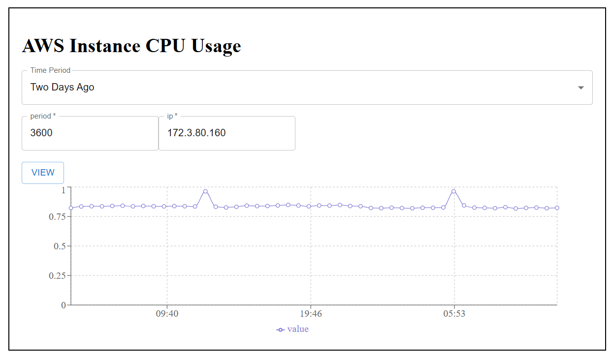

# CPU_USAGE_FRONTEND

Web UI to view performance CPU usage information for an AWS instance

## Getting started


Clone project
```bash
git clone https://github.com/yael84324/cpu_usage_frontend.git

```

Navigate to the project directory
```bash
cd cpu_usage_frontend

```

Install dependencies
```bash
npm i

```

Run the project
```bash
npm start

```

The application should now be running, check in the terminal which port the application was running on and access it.
For example, this could be in http://localhost:5173/


